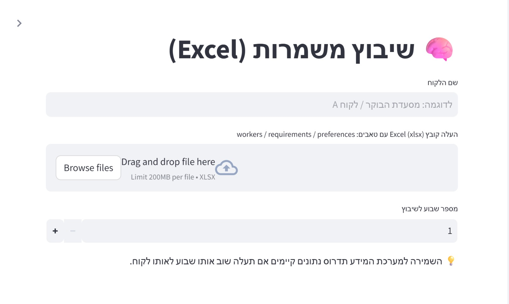
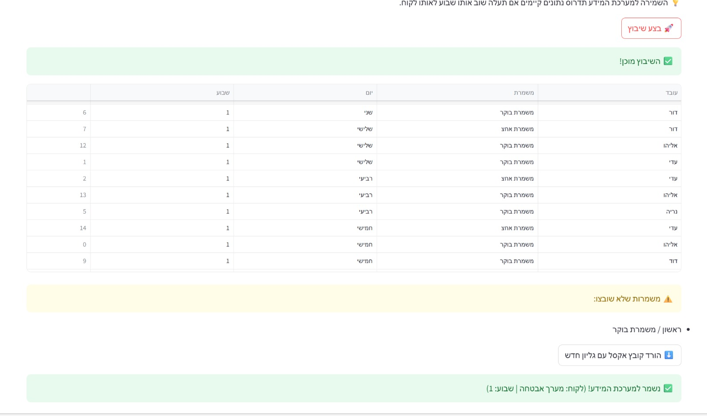

# Employee Shift Scheduling System

A Python and Streamlit-based system for automatic employee shift scheduling.

This system assigns employees to shifts based on availability and operational needs.

## Technologies
- Python
- Streamlit
- Pandas
- NumPy
- Plotly
- PostgreSQL

## Features
- Employee login system
- Excel file upload
- Automatic shift assignment
- Data visualization

## Screenshots

### Login Screen

### Excel Upload

### Shift Assignment

## Reports
The project also includes documentation:

- System Analysis Report
- Project Management Report
